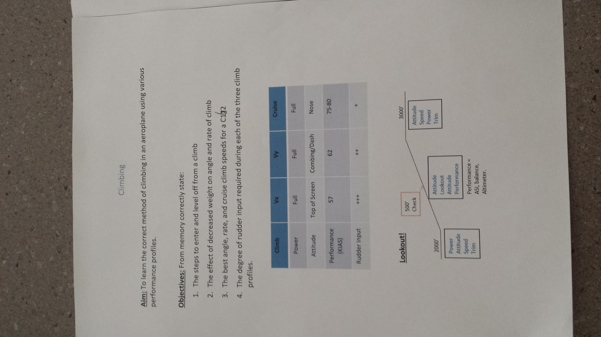
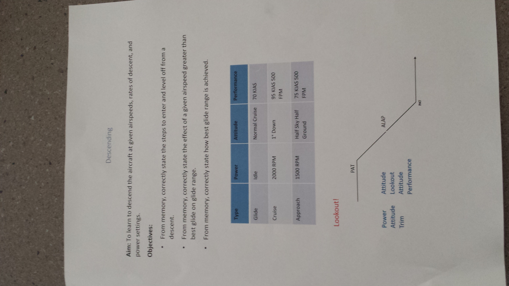

# Climbing and Descending

# 20151218

## Climbing

### Aim

To learn the correct method of climbing in an aeroplane using various
performance profiles.

### Objectives

From memory correctly state:

1. The steps to enter and level off from a climb

2. The effect of decreased weight on angle and rate of climb

3. The best, angle, and cruise climb speeds for a C162

4. The degree of rudder input required during each of the three climb profiles

| Climb              | Vx            | Vy           | Cruise |
|:-------------------|:-------------:|:------------:|:------:|
| Power              | Full          | Full         | Full   |
| Attitude           | Top of screen | Combing/Dash | Nose   |
| Performance (KIAS) | 57            | 62           | 75-80  |
| Rudder input       | +++           | ++           | +      |

### Work Flow

* Begin climb `2000ft`

  * **P**ower

  * **A**ttitude

  * **S**peed

  * **T**rim

* Maintain climb, `500ft` check

  * **A**ttitude

  * **L**ookout

  * **A**ttitude

  * **P**erformance

    * Air Speed Indicator

    * Balance

    * Altimeter

* Exit climb `3000ft`

  * **A**ttitude

  * **S**peed

  * **P**ower

  * **T**rim

----

## Descending

### Aim

To learn to descend the aircraft at given airspeeds, rates of descent, and power
settings.

### Objectives

* From memory, correctly state the steps to enter and level off from a descent.

* From memory, correctly state the effect of a given airspeed greater than best
  glide on a glide range.

* From memory, correctly state how best glide range is achieved.

| Type     | Power   | Attitude             | Performance   |
|:-------------------|:--------------------:|:-------------:|
| Glide    | Idle    | Normal Cruise        | 70KIAS        |
| Cruise   | 2000rpm | 1deg down            | 90KIAS 500FPM |
| Approach | 1500rpm | Half sky/half ground | 75KIAS 500FPM |

### Work Flow

* Begin descent

  * **P**ower

  * **A**ttitude

  * **T**rim

* Maintain descent

  * **A**ttitude

  * **L**ookout

  * **A**ttitude

  * **P**erformance

* Exit descent

  * **P**ower

  * **A**ttitude

  * **T**rim

----

### Handout

----

