# Trainee Flight Record

### Basic Flight Training Phase

----

### P1.1 Effects of Controls

* **Date:** 20151214
* **Sequence:** P1.1
* **Aircraft:** C162/LDO
* **Dual day:** 1.2 hours
* **Dual prog:** 1.2 hours
* **Instructor:** Michael Ward
* **Total:** 1.2 hours

----

### P1.2 Straight & Level

* **Date:** 20151218
* **Sequence:** P1.2 Straight & Level
* **Aircraft:** C162/LDO
* **Dual day:** 1.0 hours
* **Dual prog:** 2.2 hours
* **Instructor:** Michael Ward
* **Total:** 2.2 hours
* **Track log:** [gpx](tracks/20151218-vh-ldo.gpx?raw=true)
* **Google Earth:** [kml](tracks/google-earth/20151218-vh-ldo.kml?raw=true) [kmz](tracks/google-earth/20151218-vh-ldo.kmz?raw=true)
* **Flight visualisation:** [doarama.com](http://doarama.com/view/595690)
* **Head camera:** [youtube](https://www.youtube.com/watch?v=13BVior4VmY)

<a href="tracks/png/20151218-vh-ldo.png?raw=true">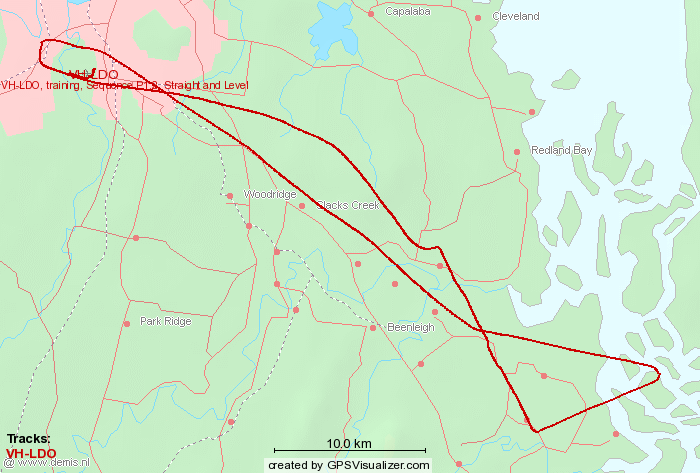</a>

----

### P1.3 Climbing & Descending

* **Date:** 20151220
* **Sequence:** P1.3 Climbing & Descending
* **Aircraft:** C162/LDO
* **Dual day:** 1.1 hours
* **Dual prog:** 3.3 hours
* **Instructor:** Michael Ward
* **Total:** 3.3 hours
* **Track log:** [gpx](tracks/20151220-vh-ldo.gpx?raw=true)
* **Google Earth:** [kml](tracks/google-earth/20151220-vh-ldo.kml?raw=true) [kmz](tracks/google-earth/20151220-vh-ldo.kmz?raw=true)
* **Flight visualisation:** [doarama.com](http://doarama.com/view/596790)
* **Head camera:** [youtube](https://www.youtube.com/watch?v=8tZ8kxsVz6E)

<a href="tracks/png/20151220-vh-ldo.png?raw=true">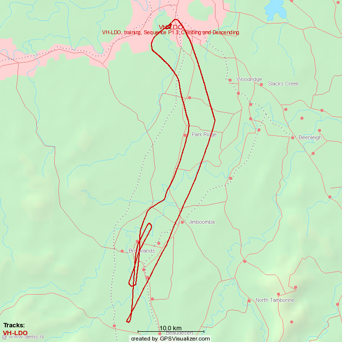</a>

----

### P1.4 Turning

* **Date:** 20160104
* **Sequence:** P1.4 Turning
* **Aircraft:** C162/LDO
* **Dual day:** 1.3 hours
* **Dual prog:** 4.6 hours
* **Instructor:** Ryan Low
* **Total:** 4.6 hours
* **Track log:** [gpx](tracks/20160104-vh-ldo.gpx?raw=true)
* **Google Earth:** [kml](tracks/google-earth/20160104-vh-ldo.kml?raw=true) [kmz](tracks/google-earth/20160104-vh-ldo.kmz?raw=true)
* **Flight visualisation:** [doarama.com](http://doarama.com/view/607004)

<a href="tracks/png/20160104-vh-ldo.png?raw=true">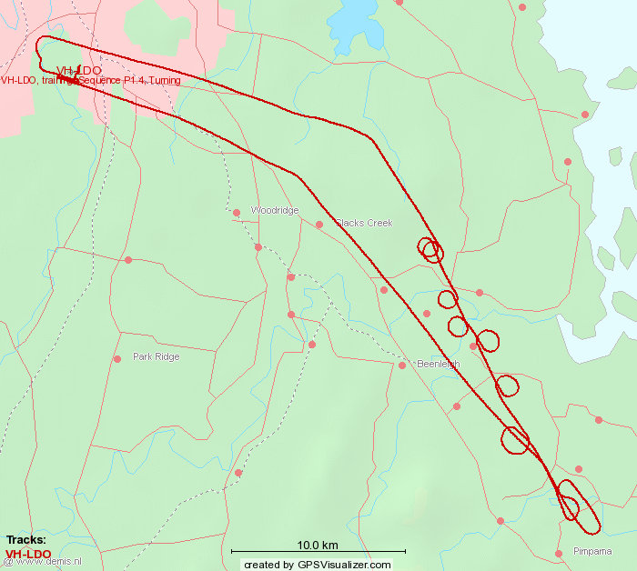</a>

----

### P1.5 Stalling

* **Date:** 20160108
* **Sequence:** P1.5 Stalling
* **Aircraft:** C162/LDO
* **Dual day:** 1.3 hours
* **Dual prog:** 5.9 hours
* **Instructor:** David Schofield
* **Total:** 5.9 hours
* **Track log:** [gpx](tracks/20160108-vh-ldo.gpx?raw=true)
* **Google Earth:** [kml](tracks/google-earth/20160108-vh-ldo.kml?raw=true) [kmz](tracks/google-earth/20160108-vh-ldo.kmz?raw=true)
* **Flight visualisation:** [doarama.com](http://doarama.com/view/611980)

<a href="tracks/png/20160108-vh-ldo.png?raw=true">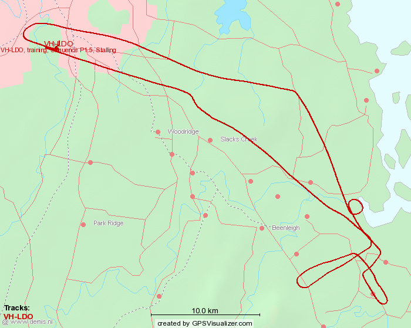</a>

----

### P1.6 Consolidation

* **Date:** 20160115
* **Sequence:** P1.6 Consolidation
* **Aircraft:** C172/AFR
* **Dual day:** 1.4 hours
* **Dual prog:** 7.3 hours
* **Instructor:** David Schofield
* **Total:** 7.3 hours
* **Track log:** [gpx](tracks/20160115-vh-afr.gpx?raw=true)
* **Google Earth:** [kml](tracks/google-earth/20160115-vh-afr.kml?raw=true) [kmz](tracks/google-earth/20160115-vh-afr.kmz?raw=true)
* **Flight visualisation:** [doarama.com](http://doarama.com/view/617610)

<a href="tracks/png/20160115-vh-afr.png?raw=true">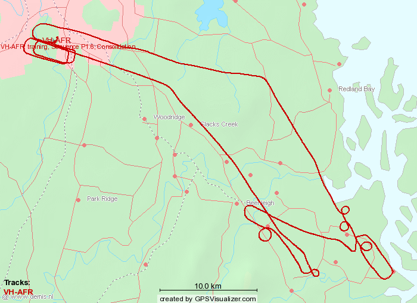</a>

----

### P2.1 Circuits

* **Date:** 20160122
* **Sequence:** P2.1 Circuits
* **Aircraft:** C172/AFR
* **Dual day:** 1.1 hours
* **Dual prog:** 8.4 hours
* **Instructor:** David Schofield
* **Total:** 8.4 hours
* **Track log:** [gpx](tracks/20160122-vh-afr.gpx?raw=true)
* **Google Earth:** [kml](tracks/google-earth/20160122-vh-afr.kml?raw=true) [kmz](tracks/google-earth/20160122-vh-afr.kmz?raw=true)
* **Flight visualisation:** [doarama.com](http://doarama.com/view/622258)
* **Head camera:** [youtube](https://www.youtube.com/watch?v=gz8Ivcjas9o)

<a href="tracks/png/20160122-vh-afr.png?raw=true">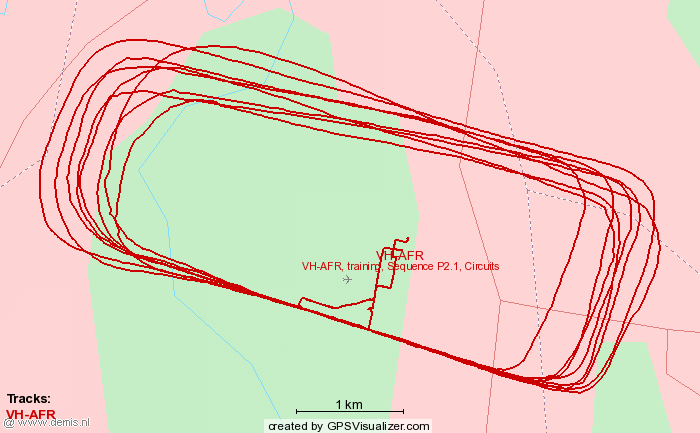</a>

  <a href="images/20160122-vh-afr/20160122_082411.jpg?raw=true">
    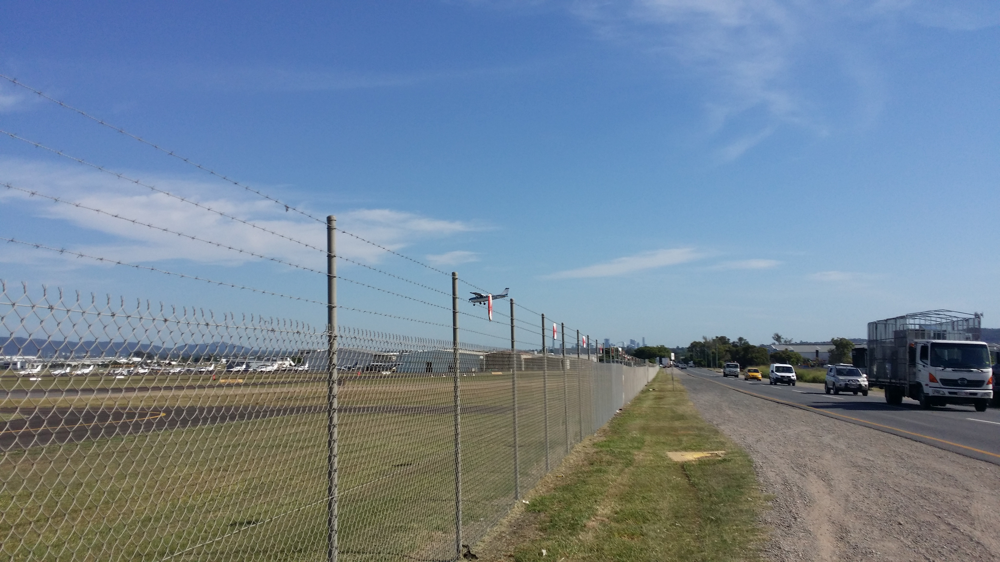
  </a>
  <a href="images/20160122-vh-afr/20160122_082856.jpg?raw=true">
    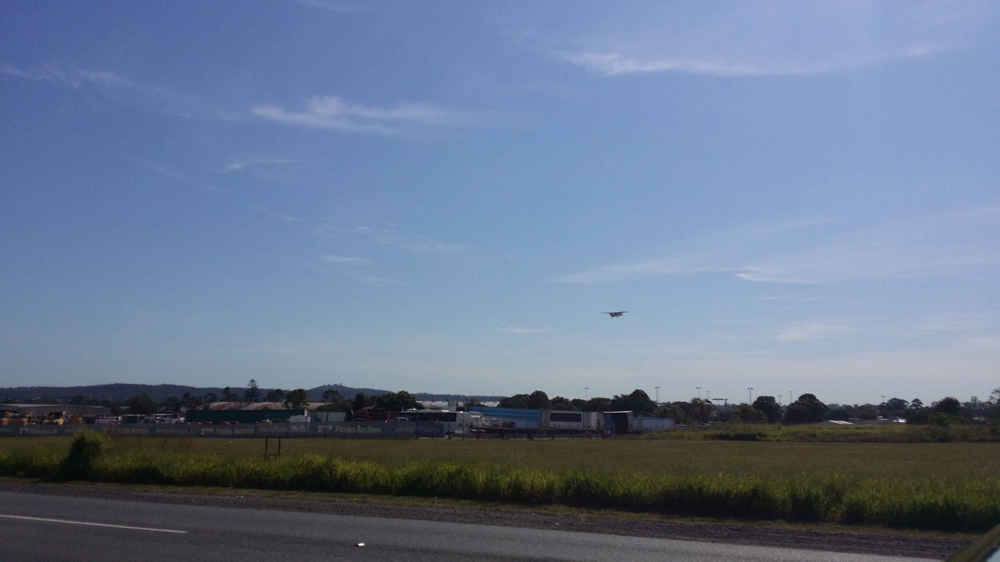
  </a>
  <a href="images/20160122-vh-afr/20160122_082902.jpg?raw=true">
    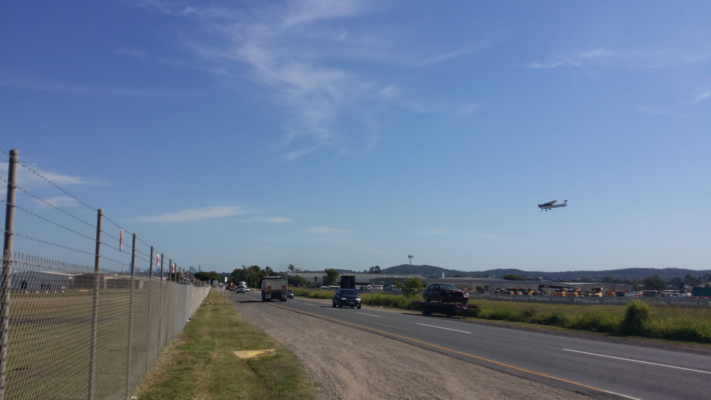
  </a>
  <a href="images/20160122-vh-afr/20160122_082905.jpg?raw=true">
    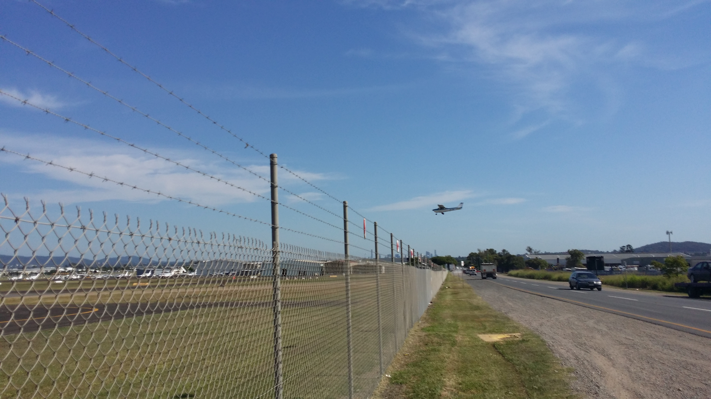
  </a>
  
  <a href="images/20160122-vh-afr/20160122_083352.jpg?raw=true">
    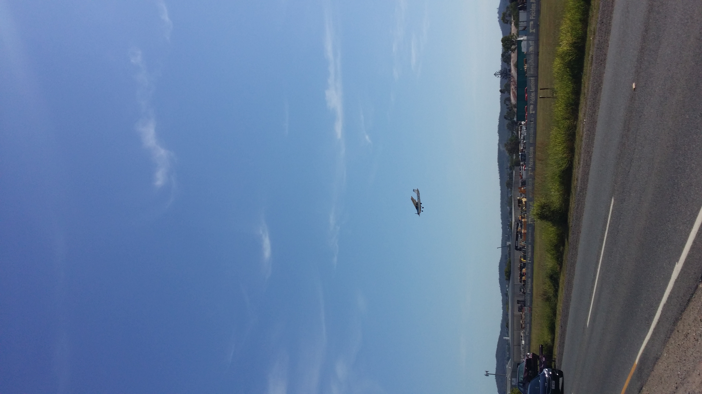
  </a>
  <a href="images/20160122-vh-afr/20160122_083353.jpg?raw=true">
    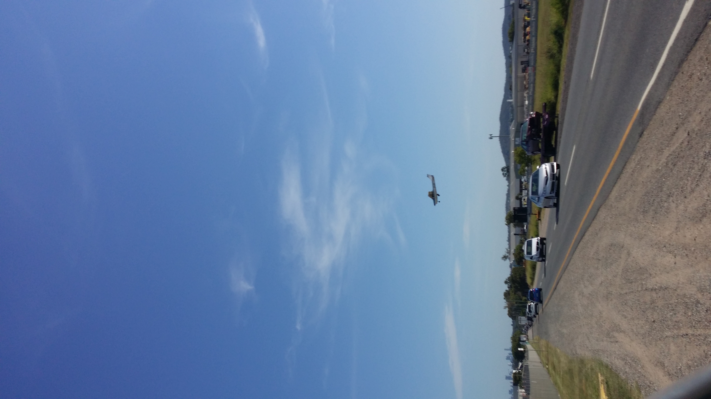
  </a>
  <a href="images/20160122-vh-afr/20160122_084902.jpg?raw=true">
    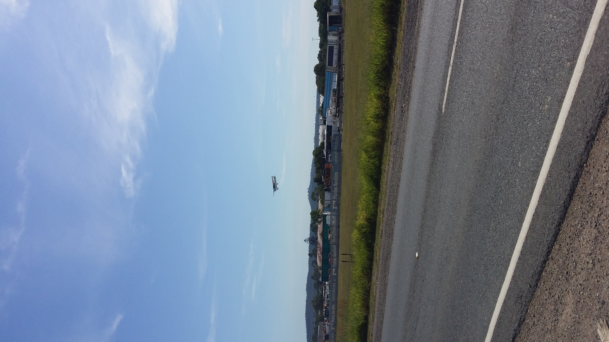
  </a>
  <a href="images/20160122-vh-afr/20160122_084906.jpg?raw=true">
    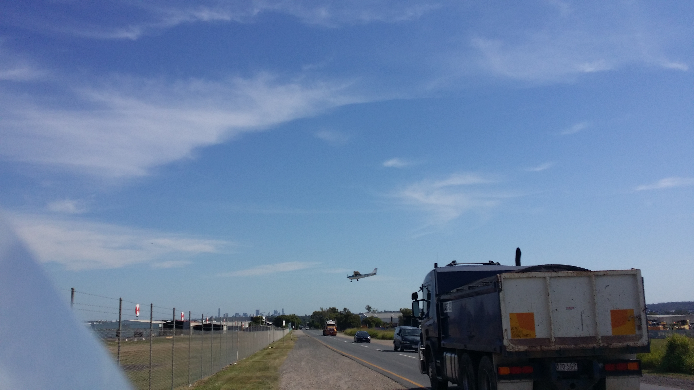
  </a>
  <a href="images/20160122-vh-afr/20160122_084908.jpg?raw=true">
    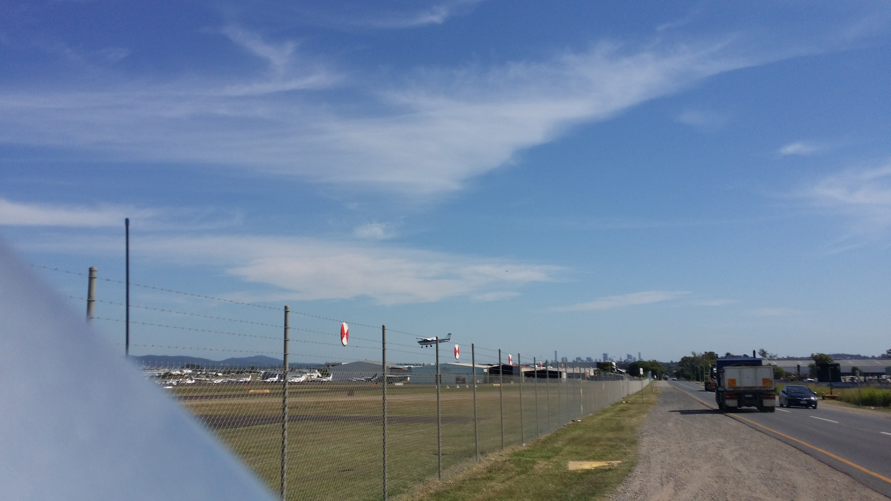
  </a>

----

### P2.2 Circuits

* **Date:** 20160129
* **Sequence:** P2.2 Circuits
* **Aircraft:** C172/AFR
* **Dual day:** 1.1 hours
* **Dual prog:** 9.5 hours
* **Instructor:** David Schofield
* **Total:** 9.5 hours
* **Track log:** [gpx](tracks/20160129-vh-afr.gpx?raw=true)
* **Google Earth:** [kml](tracks/google-earth/20160129-vh-afr.kml?raw=true) [kmz](tracks/google-earth/20160129-vh-afr.kmz?raw=true)
* **Flight visualisation:** [doarama.com](http://doarama.com/view/626694)
* **Head camera:** [youtube](https://www.youtube.com/watch?v=k9c1GdxkdQY)

<a href="tracks/png/20160129-vh-afr.png?raw=true">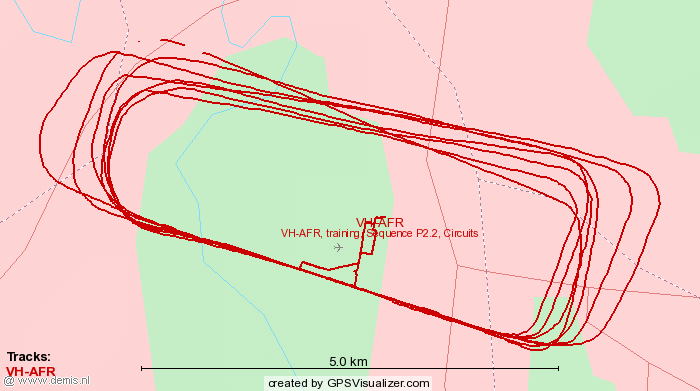</a>

----

### P2.3 Circuits

* **Date:** 20160205
* **Sequence:** P2.3 Circuits
* **Aircraft:** C172/AFR
* **Dual day:** 1.1 hours
* **Dual prog:** 10.6 hours
* **Instructor:** David Schofield
* **Total:** 10.6 hours
* **Track log:** [gpx](tracks/20160205-vh-afr.gpx?raw=true)
* **Google Earth:** [kml](tracks/google-earth/20160205-vh-afr.kml?raw=true) [kmz](tracks/google-earth/20160205-vh-afr.kmz?raw=true)
* **Flight visualisation:** [doarama.com](http://doarama.com/view/635027)

<a href="tracks/png/20160205-vh-afr.png?raw=true">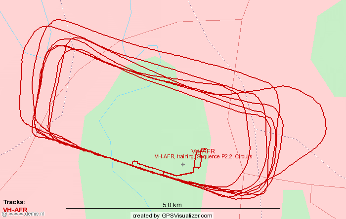</a>

----

### P2.4 Circuits

* **Date:** 20160212
* **Sequence:** P2.4 Circuits
* **Aircraft:** C172/AFR
* **Dual day:** 1.1 hours
* **Dual prog:** 11.7 hours
* **Instructor:** David Schofield
* **Total:** 11.7 hours
* **Track log:** [gpx](tracks/20160212-vh-afr.gpx?raw=true)
* **Google Earth:** [kml](tracks/google-earth/20160212-vh-afr.kml?raw=true) [kmz](tracks/google-earth/20160212-vh-afr.kmz?raw=true)
* **Flight visualisation:** [doarama.com](http://doarama.com/view/640001)
* **Head camera:** [youtube](https://www.youtube.com/watch?v=e7UcjgxOmDw)

<a href="tracks/png/20160212-vh-afr.png?raw=true">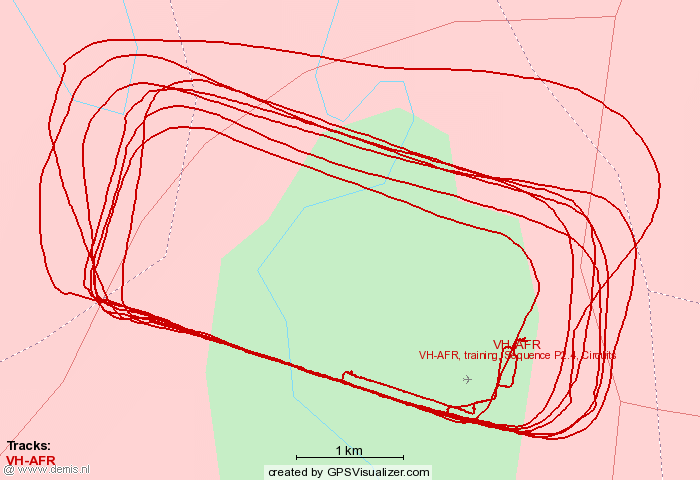</a>

----

### P2.5 Circuit Emergencies

* **Date:** 20160218
* **Sequence:** P2.5 Circuit Emergencies
* **Aircraft:** C172/AFR
* **Dual day:** 1.1 hours
* **Dual prog:** 12.8 hours
* **Instructor:** David Schofield
* **Total:** 12.8 hours
* **Track log:** [gpx](tracks/20160218-vh-afr.gpx?raw=true)
* **Google Earth:** [kml](tracks/google-earth/20160218-vh-afr.kml?raw=true) [kmz](tracks/google-earth/20160218-vh-afr.kmz?raw=true)
* **Flight visualisation:** [doarama.com](http://doarama.com/view/644663)
* **Head camera:** [youtube](https://www.youtube.com/watch?v=EO4D4zFnpIU)

<a href="tracks/png/20160218-vh-afr.png?raw=true">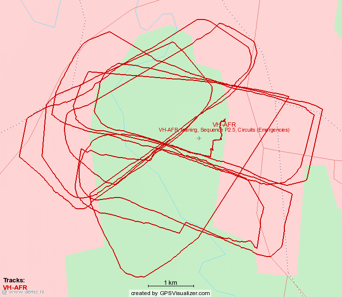</a>

  <a href="images/20160218-vh-afr/20160218_090347.jpg?raw=true">
    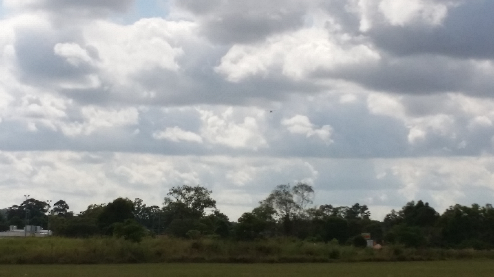
  </a>
  <a href="images/20160218-vh-afr/20160218_090348.jpg?raw=true">
    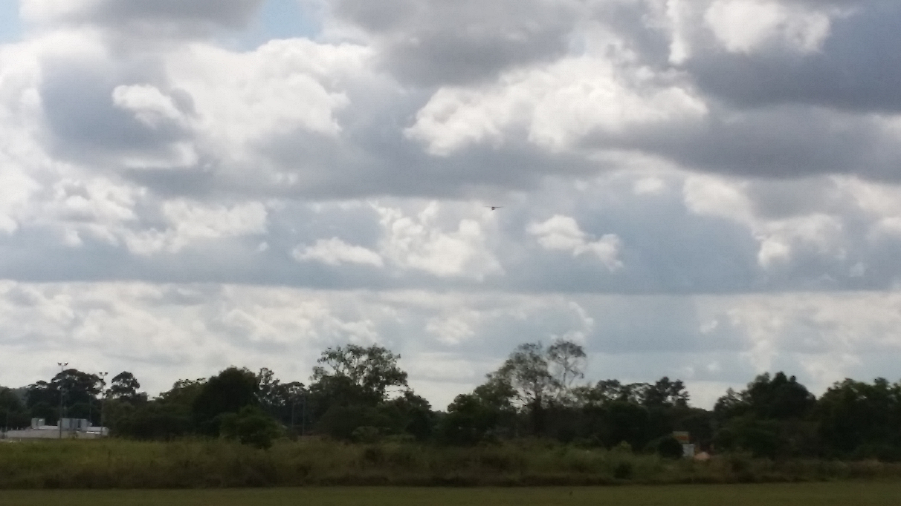
  </a>
  <a href="images/20160218-vh-afr/20160218_090351.jpg?raw=true">
    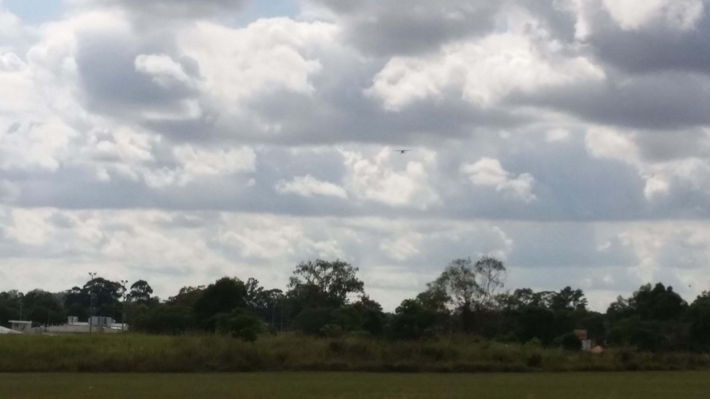
  </a>
  <a href="images/20160218-vh-afr/20160218_090409.jpg?raw=true">
    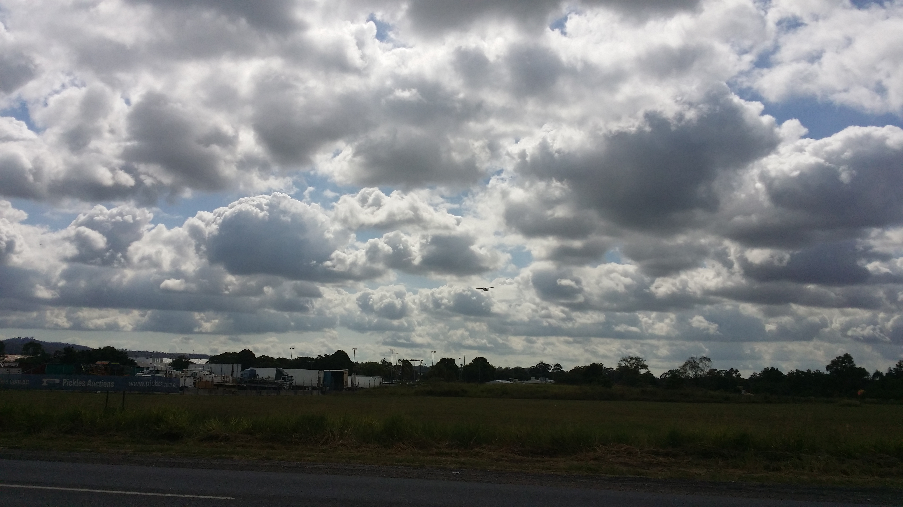
  </a>
  
  
  <a href="images/20160218-vh-afr/20160218_090423.jpg?raw=true">
    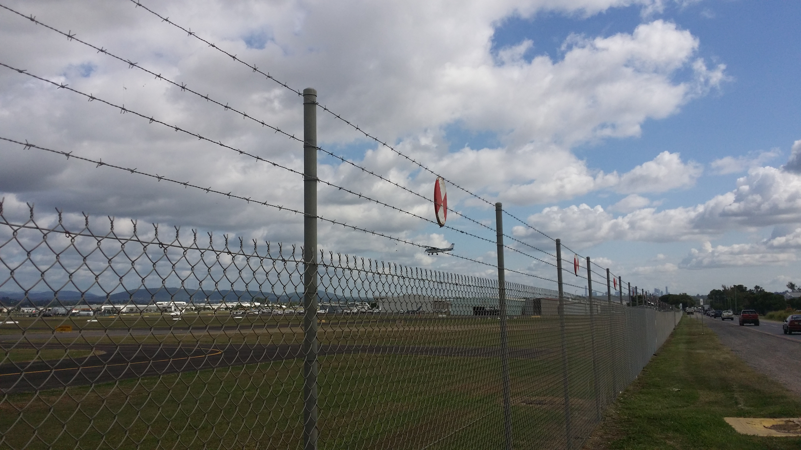
  </a>
  <a href="images/20160218-vh-afr/20160218_090432.jpg?raw=true">
    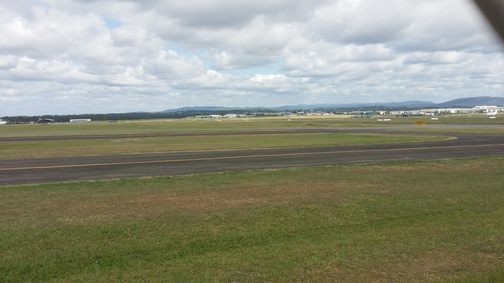
  </a>
  <a href="images/20160218-vh-afr/20160218_090436.jpg?raw=true">
    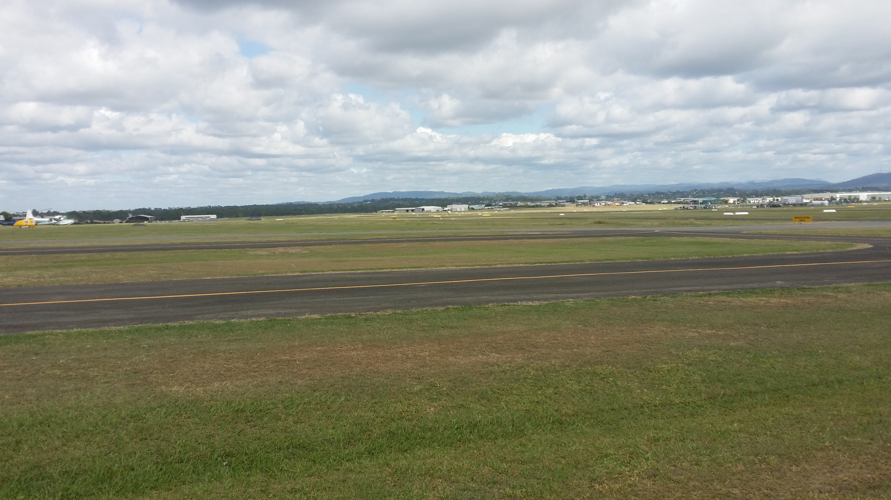
  </a>
  <a href="images/20160218-vh-afr/20160218_090441.jpg?raw=true">
    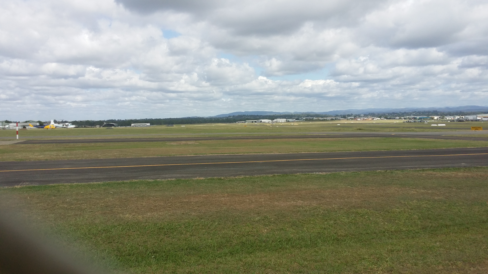
  </a>  
  <a href="images/20160218-vh-afr/20160218_090446.jpg?raw=true">
    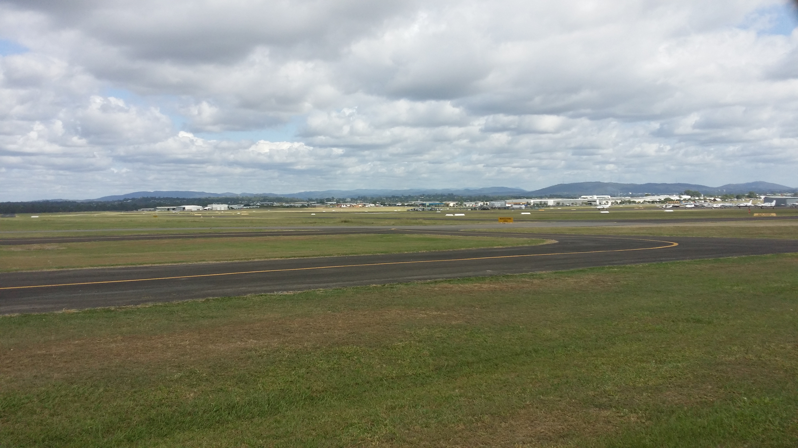
  </a>
  <a href="images/20160218-vh-afr/20160218_090452.jpg?raw=true">
    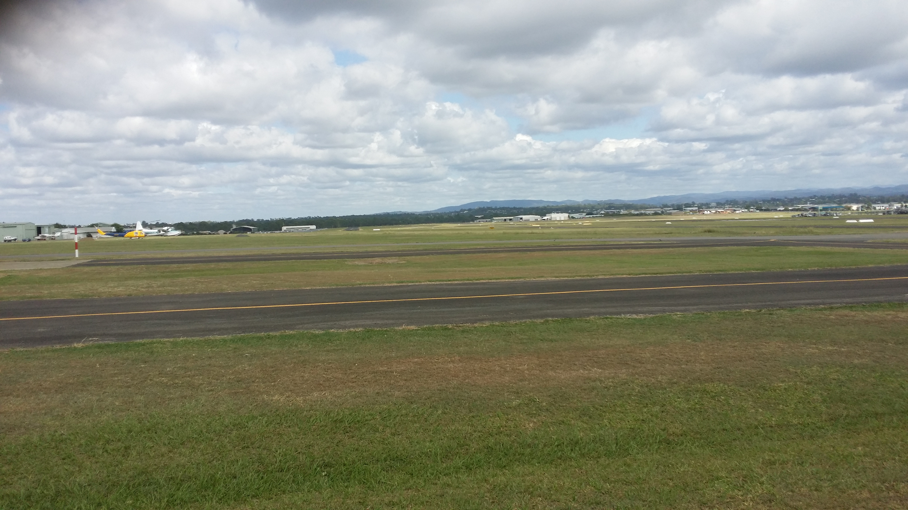
  </a>
  <a href="images/20160218-vh-afr/20160218_090454.jpg?raw=true">
    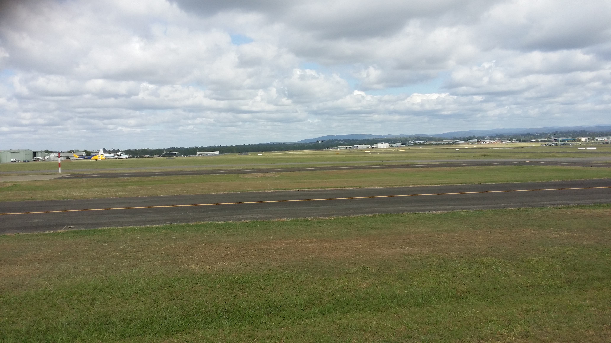
  </a>
  <a href="images/20160218-vh-afr/20160218_090459.jpg?raw=true">
    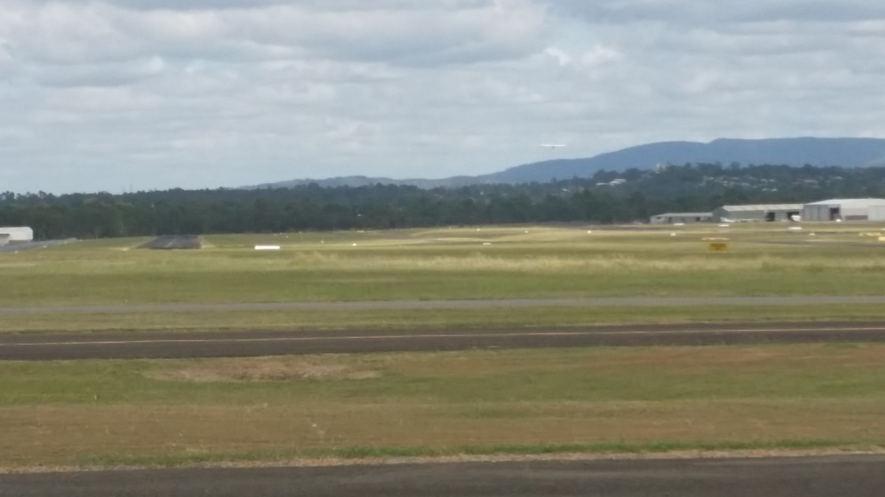
  </a>
  <a href="images/20160218-vh-afr/20160218_090501.jpg?raw=true">
    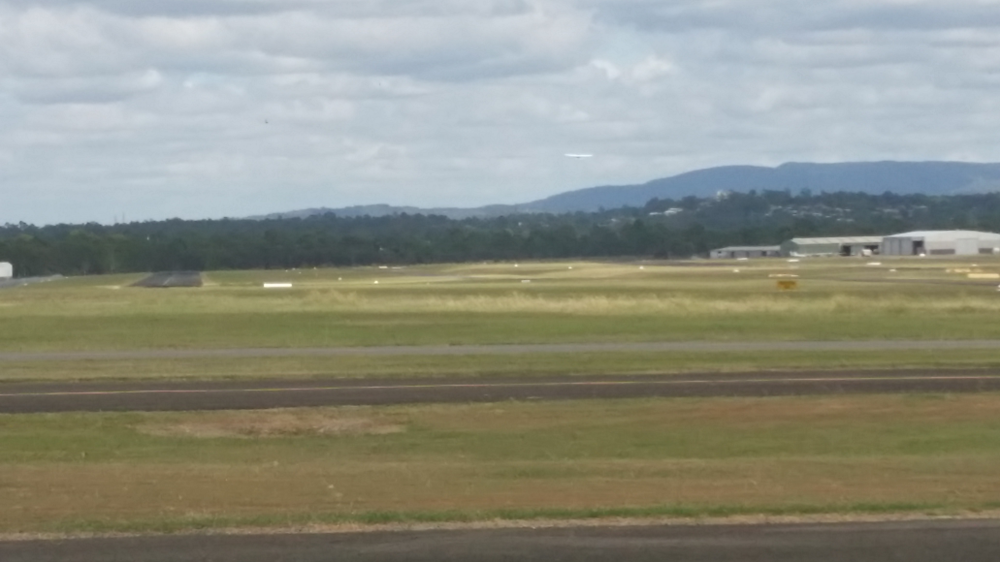
  </a>
  <a href="images/20160218-vh-afr/20160218_090502.jpg?raw=true">
    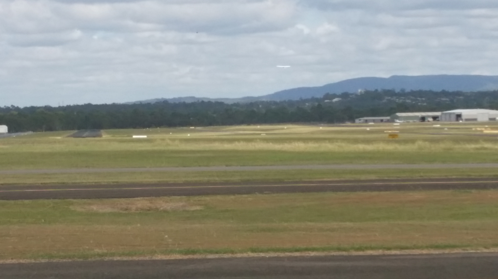
  </a>

